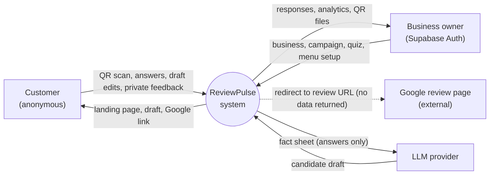
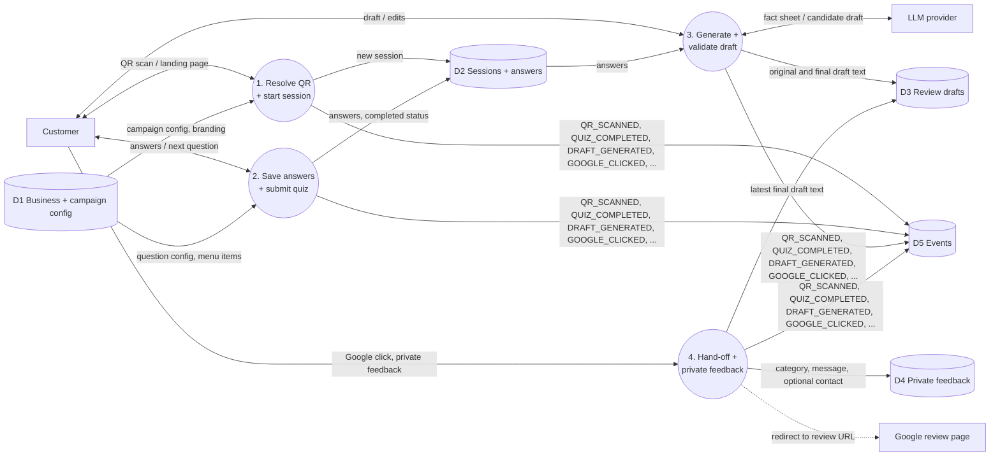
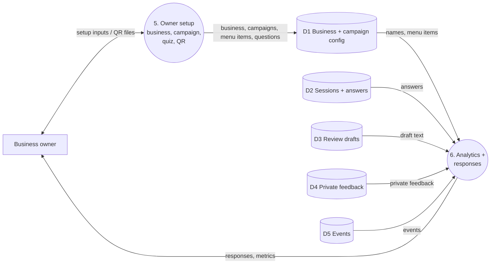
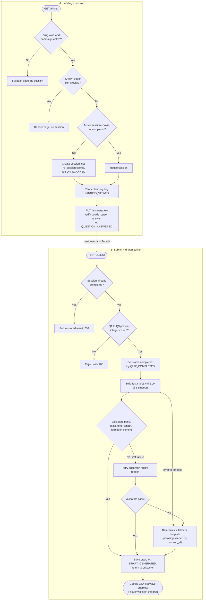
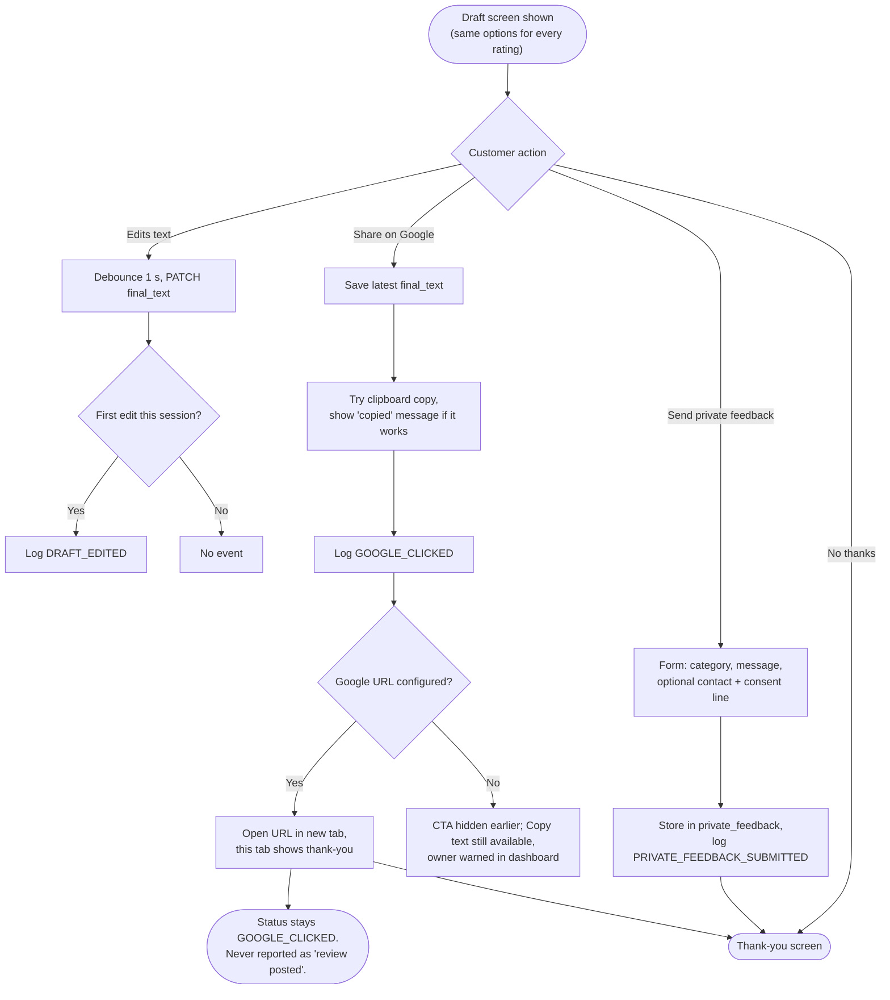

# ReviewPulse: DFD and Program Flow (consistent with PRD v1.1)

Notation for the DFDs: rectangles are external entities, circles are processes, cylinders are data stores, solid arrows are data flows, dashed arrows are hand-offs where no data returns. Store names are used identically in every diagram.

| Store | Tables |
|---|---|
| D1 Business + campaign config | businesses, campaigns, menu_items, questions |
| D2 Sessions + answers | sessions, answers |
| D3 Review drafts | review_drafts |
| D4 Private feedback | private_feedback |
| D5 Events | events (plus session_flags for anomaly review) |

---

## 1. DFD Level 0 (context)

---

## 2. DFD Level 1, customer side (processes 1 to 4)

---

## 3. DFD Level 1, owner side (processes 5 and 6)

All metrics are computed from D2 and D5 at query time (no stored counters). Every completed session is included (CG-10).

---

## 4. Program flow A: landing, session and submit/draft pipeline

---

## 5. Program flow B: draft edit, Google hand-off, private feedback

